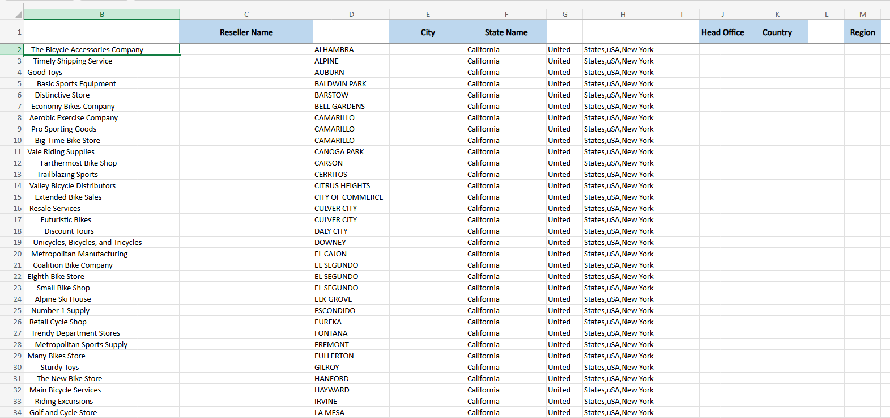
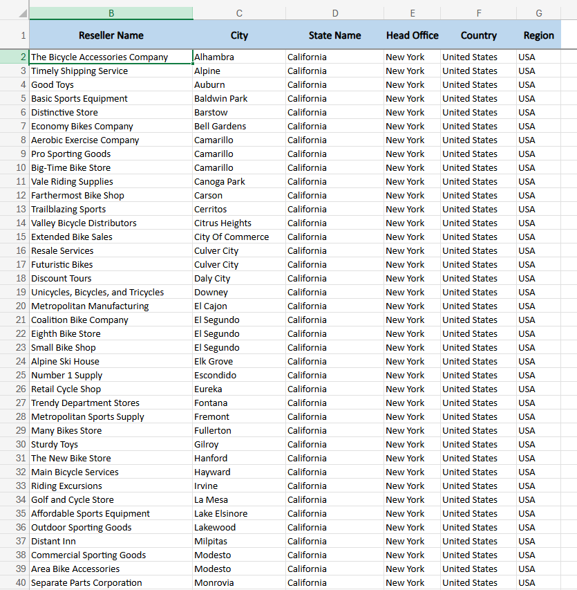

# 📊 Padronização e Limpeza de Dados - Adventure Works

Este projeto prático de Excel foca na limpeza e padronização de uma base de dados "suja" de revendedores da empresa fictícia *Adventure Works*. O objetivo foi transformar dados brutos e inconsistentes em informações prontas para análise.

## 📝 Cenário (Case)
A base de dados original ("Reseller Details") foi extraída de um sistema legado e continha diversos erros comuns em ETL (Extract, Transform, Load), como:
* Espaços extras desnecessários no início e fim de textos.
* Inconsistência em letras maiúsculas e minúsculas (Cidades e IDs).
* Dados aglutinados que precisavam ser separados (Ex: Estado e País na mesma célula).
* Dados separados que precisavam ser unidos.

## 🛠️ Ferramentas e Funções Utilizadas

O projeto foi realizado no **Microsoft Excel**. Abaixo, a lista de funções aplicadas para resolver os problemas, com suas respectivas traduções (Inglês/Português):

| Função (EN) | Função (PT-BR) | Aplicação no Projeto |
| :--- | :--- | :--- |
| **TRIM** | `ARRUMAR` | Remover espaços em branco excessivos dos nomes dos revendedores. |
| **PROPER** | `PRI.MAIÚSCULA` | Corrigir a formatação dos nomes das cidades (apenas 1ª letra maiúscula). |
| **LEFT** | `ESQUERDA` | Extrair a palavra "States" do início de uma string de texto. |
| **RIGHT** | `DIREITA` | Extrair "New York" do final de uma string. |
| **MID** | `EXT.TEXTO` | Extrair o código "uSA" do meio de uma string de identificação. |
| **UPPER** | `MAIÚSCULA` | Padronizar o código extraído ("USA") para caixa alta. |
| **CONCAT** | `CONCAT` | Unir colunas de endereço garantindo o espaçamento correto. |
| **Paste Values** | `Colar Valores` | Técnica usada para remover dependência de fórmulas antes de excluir colunas auxiliares. |

## 🚀 Passo a Passo da Solução

1. **Análise Inicial:** Identificação das colunas `B`, `D`, `G`, `H`, `I` e `L` como contendo dados sujos ou desnecessários.
2. **Tratamento de Strings:** Aplicação das fórmulas citadas acima em novas colunas para gerar os dados limpos.
3. **Consolidação:** Uso do recurso **Colar Valores** para fixar os resultados das fórmulas como texto estático.
4. **Limpeza Final:** Exclusão das colunas originais (sujas) e organização do layout final para análise.

## 📸 Antes e Depois

### Base Original (Suja)

### Base Final (Limpa e Padronizada)

---
*Este exercício faz parte da minha jornada de aprendizado em Análise de Dados e Business Intelligence.*
