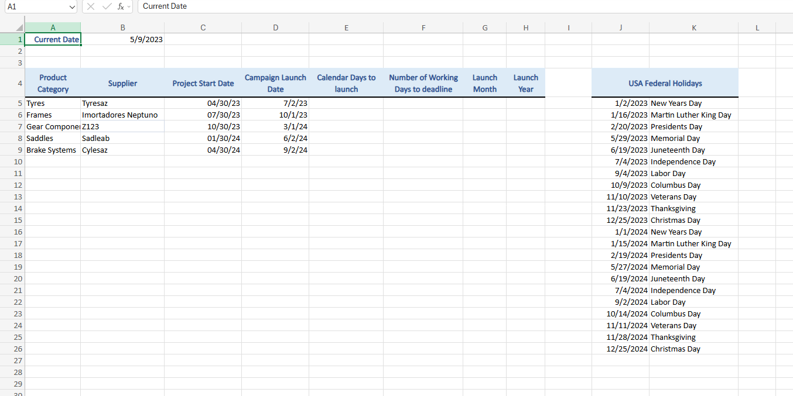
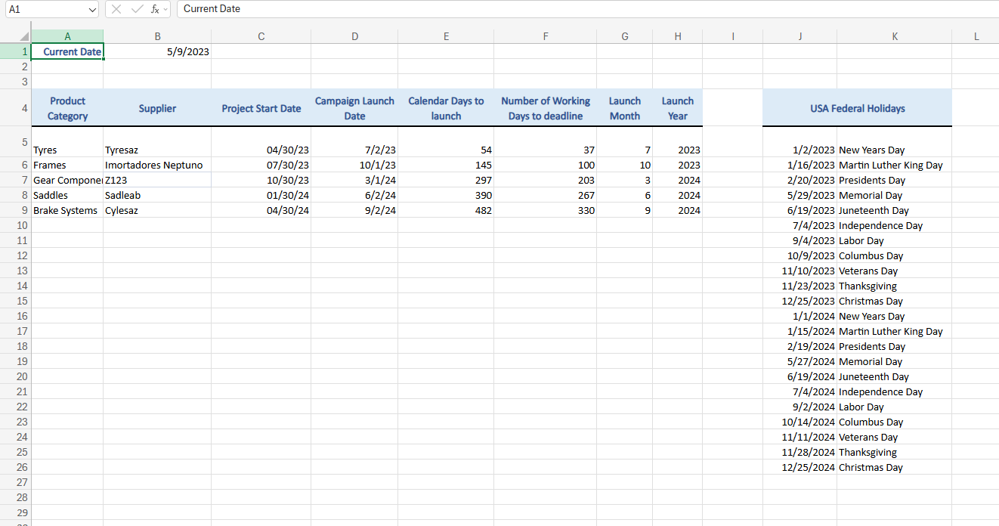

# 📅 Gestão de Prazos e Cronograma - Adventure Works

Este projeto foca na manipulação de dados temporais (Datas) no Excel para planejamento estratégico de campanhas de marketing. O objetivo foi calcular prazos reais, considerando dias úteis e feriados, para dar visibilidade ao cronograma de lançamentos da *Adventure Works*.

## 💼 Cenário (Business Case)
A equipe de marketing precisava validar a viabilidade dos prazos de lançamento de 5 grandes campanhas nos EUA. O desafio era transformar datas estáticas em métricas de gestão, respondendo:
1. Quantos dias corridos faltam até o prazo final?
2. Quantos **dias úteis** reais a equipe tem para trabalhar (excluindo fins de semana e feriados nacionais)?
3. Qual a sazonalidade (Mês/Ano) de cada entrega?

## 🛠️ Ferramentas e Funções Utilizadas

O projeto foi desenvolvido no **Microsoft Excel**, utilizando fórmulas de data e hora e referências absolutas para automatizar cálculos.

| Função (EN) | Função (PT-BR) | Aplicação no Projeto |
| :--- | :--- | :--- |
| **TODAY** | `HOJE` | Gerar a data de referência (data atual ou data de corte do relatório). |
| **NETWORKDAYS** | `DIATRABALHOTOTAL` | Calcular o intervalo de dias úteis entre duas datas, excluindo automaticamente fins de semana e uma lista personalizada de feriados (`$J$5:$J$26`). |
| **MONTH** | `MÊS` | Extração do mês da data limite para análise de sazonalidade. |
| **YEAR** | `ANO` | Extração do ano para agrupamento de relatórios. |
| **Operadores** | `-` (Subtração) | Cálculo simples de dias corridos (Data Final - Data Inicial). |

## 🚀 Lógica da Solução

1.  **Definição de Referência:** Estabelecida uma data de corte ("Hoje") na célula `B1` para servir de base para todos os cálculos.
2.  **Cálculo de Dias Úteis (O Desafio):**
    * Utilizei a função `NETWORKDAYS` referenciando uma tabela auxiliar de feriados federais dos EUA.
    * Apliquei **Referências Absolutas (`$`)** (ex: `$B$1`, `$J$5:$J$26`) para garantir que, ao arrastar a fórmula para as outras campanhas, a data de início e a lista de feriados permanecessem fixas.
3.  **Extração de Atributos:** Separação dos dados de Mês e Ano para facilitar filtros futuros em Tabelas Dinâmicas.

## 📸 Antes e Depois

### Base Original

### Cronograma Calculado

---
*Projeto desenvolvido como parte do portfólio de Análise de Dados e BI.*
